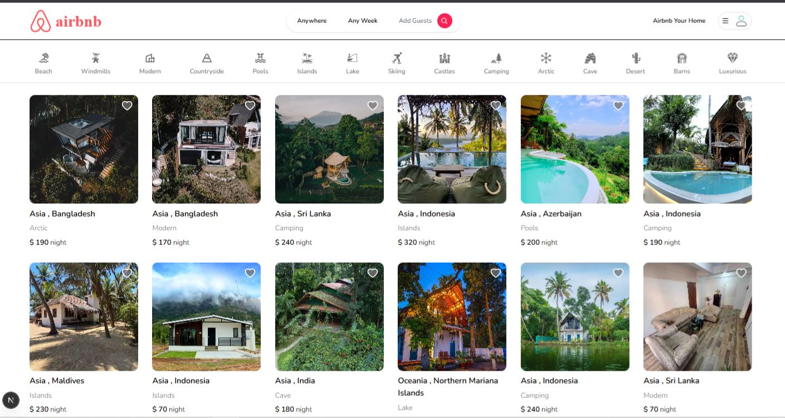

# 🏠 Airbnb Clone

A full-stack Airbnb clone built with modern technologies, allowing users to book accommodations and hosts to list their properties.

## ✨ Features

- 🔐 User Authentication (Email/Password, Google, Github)
- 🏡 Property Listings with Advanced Filtering
- 📍 Interactive Map Integration
- 📸 Image Upload with Cloudinary
- 💳 Booking System
- 🌍 Location Selection with World Countries
- 🎨 Modern UI/UX Design
- 📱 Fully Responsive

## 🛠️ Tech Stack

- **Frontend:**

  - Next.js 13+ (App Router)
  - React
  - Tailwind CSS
  - Zustand (State Management)

- **Backend:**

  - Next.js API Routes
  - Prisma (ORM)
  - MongoDB
  - Cloudinary

- **Authentication:**
  - NextAuth.js
  - Google OAuth
  - Github OAuth
- **Additional Features:**

  - Real-time Availability Calendar
  - Advanced Search Filters
  - User Reviews & Ratings
  - Favorite Listings
  - Instant Booking
  - Secure Payment Processing
  - Host Dashboard
  - Guest Messaging System

- **Development Tools:**

  - TypeScript
  - ESLint
  - Prettier
  - Git Version Control
  - Vercel Deployment

- **Performance & Security:**

  - Server-side Rendering (SSR)
  - API Rate Limiting
  - Input Validation
  - Error Handling
  - Data Encryption
  - Secure Authentication Flow

- **Testing:**
  - Unit Testing
  - Integration Testing
  - End-to-End Testing
  - Performance Testing

## Contributing

We welcome contributions to this project! Here's how you can help:

### How to Contribute

1. Fork the repository
2. Create a new branch (`git checkout -b feature/improvement`)
3. Make your changes
4. Commit your changes (`git commit -m 'Add some improvement'`)
5. Push to the branch (`git push origin feature/improvement`)
6. Open a Pull Request

### Guidelines

- Please ensure your code follows the project's coding standards
- Write clear, descriptive commit messages
- Add tests for new features
- Update documentation as needed
- Follow the existing code style and formatting

### Report Issues

If you find a bug or have a feature request, please open an issue with:

- A clear description of the problem/feature
- Steps to reproduce (for bugs)
- Expected behavior
- Screenshots if applicable

### Code of Conduct

- Be respectful and inclusive
- Provide constructive feedback
- Help maintain a positive community

Thank you for your interest in contributing to this project!

Follow on social media:

  

